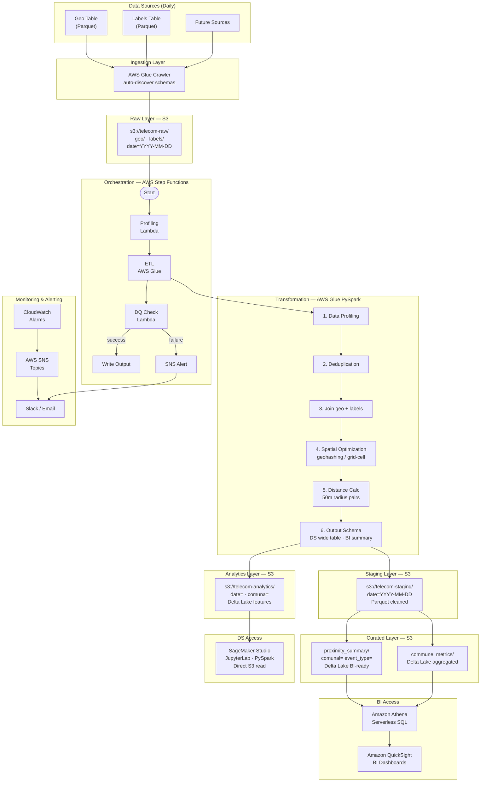

# Architecture Diagram — Telecom Proximity Analytics

## Mermaid Overview



---

## ASCII Detail

```
┌─────────────────────────────────────────────────────────────────────────────────┐
│                            DATA SOURCES (Daily)                                 │
│  ┌──────────────┐    ┌──────────────┐    ┌──────────────┐                       │
│  │  Geo Table    │    │ Labels Table │    │  Future ...  │                       │
│  │  (Parquet)    │    │  (Parquet)   │    │              │                       │
│  └──────┬───────┘    └──────┬───────┘    └──────┬───────┘                       │
└─────────┼──────────────────┼──────────────────┼─────────────────────────────────┘
          │                  │                  │
          ▼                  ▼                  ▼
┌─────────────────────────────────────────────────────────────────────────────────┐
│                         INGESTION LAYER                                         │
│  ┌─────────────────────────────────────────────────────────────────────────┐    │
│  │                    AWS Glue Crawler (auto-discover schemas)             │    │
│  └─────────────────────────────────────────────────────────────────────────┘    │
└────────────────────────────────────┬────────────────────────────────────────────┘
                                     │
                                     ▼
┌─────────────────────────────────────────────────────────────────────────────────┐
│                              RAW LAYER (S3)                                     │
│                                                                                 │
│  s3://telecom-raw/                                                              │
│  ├── geo/                                                                       │
│  │   └── date=YYYY-MM-DD/     (Parquet, append-only)                           │
│  ├── labels/                                                                    │
│  │   └── date=YYYY-MM-DD/     (Parquet, append-only)                           │
│  └── future_source/                                                             │
│      └── date=YYYY-MM-DD/     (Parquet, append-only)                           │
└────────────────────────────────────┬────────────────────────────────────────────┘
                                     │
                                     ▼
┌─────────────────────────────────────────────────────────────────────────────────┐
│                        ORCHESTRATION (AWS Step Functions)                        │
│                                                                                 │
│  ┌──────────┐    ┌──────────┐    ┌──────────┐    ┌──────────┐                   │
│  │  Start    │───▶│ Profiling│───▶│   ETL    │───▶│  DQ Check│                   │
│  │          │    │ (Lambda) │    │  (Glue)  │    │ (Lambda) │                   │
│  └──────────┘    └──────────┘    └──────────┘    └─────┬────┘                   │
│                                                        │                         │
│                              ┌──────────────────────────┼──────────────┐         │
│                              │ success                  │ failure      │         │
│                              ▼                          ▼              │         │
│                    ┌──────────────┐            ┌──────────────┐       │         │
│                    │ Write Output │            │  SNS Alert   │       │         │
│                    └──────────────┘            └──────────────┘       │         │
└────────────────────────────────────┬────────────────────────────────────────────┘
                                     │
                                     ▼
┌─────────────────────────────────────────────────────────────────────────────────┐
│                     TRANSFORMATION (AWS Glue - PySpark)                          │
│                                                                                 │
│  ┌─────────────────────────────────────────────────────────────────────────┐    │
│  │  1. Data Profiling (row counts, NULLs, duplicates, coord ranges)       │    │
│  │  2. Deduplication (geo: first comuna/lat/lon; labels: aggregate events) │    │
│  │  3. Join geo + labels on customer_id                                    │    │
│  │  4. Spatial optimization (geohashing / grid-cell bucketing)             │    │
│  │  5. Distance calculation (50m radius pairs)                             │    │
│  │  6. Output schema definition (DS wide table / BI summary)              │    │
│  └─────────────────────────────────────────────────────────────────────────┘    │
└────────────────────────────────────┬────────────────────────────────────────────┘
                                     │
          ┌──────────────────────────┴──────────────────────────┐
          │                                                     │
          ▼                                                     ▼
┌─────────────────────────────┐                   ┌─────────────────────────────┐
│    STAGING LAYER (S3)       │                   │    ANALYTICS LAYER (S3)      │
│                             │                   │                             │
│  s3://telecom-staging/      │                   │  s3://telecom-analytics/     │
│  └── date=YYYY-MM-DD/       │                   │  └── date=YYYY-MM-DD/        │
│      (Parquet, cleaned)     │                   │      comuna=                 │
│                             │                   │      (Delta Lake, features)  │
└─────────────────────────────┘                   └──────────────┬──────────────┘
                                                                 │
                                                                 │
                              ┌──────────────────────────────────┤
                              │                                  │
                              ▼                                  ▼
┌─────────────────────────────────────────┐   ┌─────────────────────────────────┐
│    CURATED LAYER (S3)                   │   │    DS ACCESS (SageMaker)        │
│                                         │   │                                 │
│  s3://telecom-curated/                  │   │  ┌─────────────────────────┐    │
│  ├── proximity_summary/                 │   │  │  SageMaker Studio       │    │
│  │   ├── comuna=                        │   │  │  - JupyterLab notebooks │    │
│  │   │   └── event_type=                │   │  │  - PySpark kernel       │    │
│  │   │       (Delta Lake, BI-ready)     │   │  │  - Direct S3 read       │    │
│  │   │                                  │   │  └─────────────────────────┘    │
│  └── commune_metrics/                   │   │                                 │
│      (Delta Lake, aggregated)           │   │  Reads: s3://telecom-analytics/ │
└──────────────────┬──────────────────────┘   └─────────────────────────────────┘
                   │
                   ▼
┌─────────────────────────────────────────────────────────────────────────────────┐
│                         BI ACCESS (Amazon Athena)                                │
│                                                                                 │
│  ┌─────────────────────────────────────────────────────────────────────────┐    │
│  │  Amazon Athena (Serverless SQL)                                         │    │
│  │  - Glue Data Catalog auto-discovers Delta tables                       │    │
│  │  - Pay-per-query; no cluster management                                │    │
│  │  - Integrates with QuickSight for dashboards                           │    │
│  └─────────────────────────────────────────────────────────────────────────┘    │
│                                                                                 │
│  ┌─────────────────────────────────────────────────────────────────────────┐    │
│  │  Amazon QuickSight                                                      │    │
│  │  - BI dashboards connected to Athena                                    │    │
│  │  - Automated reporting for business stakeholders                        │    │
│  └─────────────────────────────────────────────────────────────────────────┘    │
└─────────────────────────────────────────────────────────────────────────────────┘
                                     │
                                     ▼
┌─────────────────────────────────────────────────────────────────────────────────┐
│                         MONITORING & ALERTING                                    │
│                                                                                 │
│  ┌──────────────┐    ┌──────────────┐    ┌──────────────┐                       │
│  │ CloudWatch   │───▶│  AWS SNS     │───▶│ Slack/Email  │                       │
│  │  Alarms      │    │  Topics      │    │  Channels    │                       │
│  └──────────────┘    └──────────────┘    └──────────────┘                       │
│                                                                                 │
│  Alerts: Pipeline failure, DQ breach, Late ingestion, Cost anomaly              │
└─────────────────────────────────────────────────────────────────────────────────┘
```

## Data Flow Summary

```
Daily Ingestion Flow:
  Source Parquet → Glue Crawler → Raw S3 (partitioned by date)
  
ETL Flow:
  Raw S3 → Glue ETL (PySpark) → Staging S3 → Analytics S3 (Delta)
                                            → Curated S3 (Delta)

Access Flow:
  Data Scientists → SageMaker Studio → reads Analytics layer (Delta)
  BI Analysts     → Athena/QuickSight → reads Curated layer (Delta)

Monitoring Flow:
  Step Functions → Lambda validators → SNS → Slack/Email
  CloudWatch → Alarms → SNS → Alerts
```
